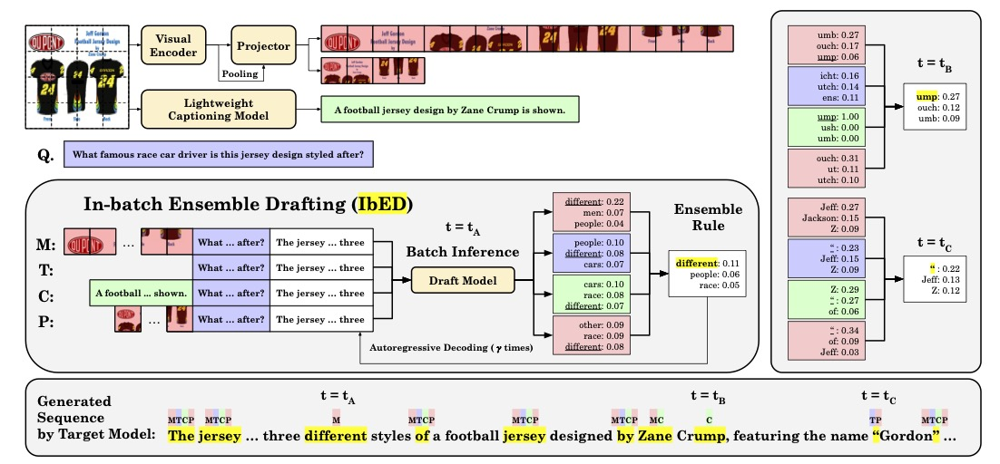

# In-batch Ensemble Drafting: Robust Speculative Decoding for LVLMs

| <a href="https://arxiv.org/abs/XXXX"><b>Arxiv Paper</b></a> |

  
   
  <b>Figure 1</b>: Overview of In-batch Ensemble Drafting (IbED). 

## Abstract

Speculative decoding (SD) accelerates the decoding stage by speculating multiple next tokens with a small draft model, which is, in turn, verified by the target model in parallel. Despite its success in LLM inference acceleration, SD largely remains unexplored for Large Vision Language Models (LVLMs), an advanced class of LLMs that can handle multimodal prompts consisting of text and image tokens. To bridge this gap, we first conduct a comprehensive benchmarking study, focusing on the effectiveness of various drafting methods: multimodal prompting (image and text) with and without image pooling and text-only prompting with and without image caption included. We observe that various drafting methods have their own advantages, and none of them consistently outperforms the others. Motivated by this observation, we propose In-batch Ensemble Drafting (IbED), a simple yet effective SD method for LVLMs. IbED leverages multiple drafting methods without incurring much additional latency via batch inference and, compared to multimodal drafting, consistently demonstrates significant improvements in block efficiency, averaging 6% (with a maximum of 23%) across a wide range of datasets. To ensure the full reproducibility of our work, we open-source our code and the custom-trained draft LVLMs.

## Coming Soon
- Inference code for IbED for each configuration
- Checkpoints of draft LVLMs
